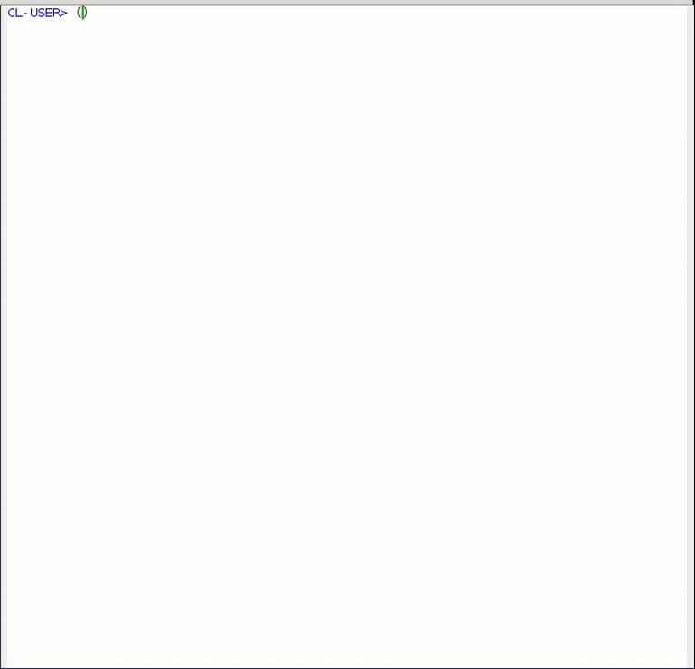

# LNB-DISTANCE

LNB-DISTANCE is a system that helps technicians calculate distances when building LNBs holder for PARABOLA with multiple LNBs.

Author: _Panji Kusuma <epanji@gmail.com>_

## Usages

Assume users already have lisp implementation and [Quicklisp](https://www.quicklisp.org/beta/) on their computer.
Place this project in folder local-projects and follow this demo.



Current demo run on [SBCL](http://www.sbcl.org/).

Find satellite

``` common-lisp
LNBD> (find-satellite "palapa d")
#<SATELLITE "Palapa D" 113.0° {10030E1CF3}>
```

``` common-lisp
LNBD> (find-satellite 113)
#<SATELLITE "Palapa D" 113.0° {10030E1CF3}>
```

Convert Feet to Centimeter

``` common-lisp
LNBD> (ft->cm 7)
213.36
```

Make LNB calculation for PARABOLA

``` common-lisp
LNBD> (make-parabola (ft->cm 7) 30.48 "telkom 4" "asiasat 5" 113 "asiasat 7")

LNB calculation for parabola with diameter 213.36 cm and depth 30.48 cm.

    Focal length    93.35 cm
    Radius          201.93 cm

This table start from WEST to EAST with focus on "Telkom 4".

    From         To           Cm
    -----------  -----------  -----
    Palapa D     Telkom 4     9.10
    Telkom 4     Telkom 4     0.00
    Telkom 4     AsiaSat 7    5.12
    Telkom 4     AsiaSat 5    14.59

#<PARABOLA diameter 213.36 cm, depth 30.48 cm {1003646A23}>
```

List of satellites

``` common-lisp
LNBD> *satellites*
(#<SATELLITE "NSS 12" 57.0° {10030E0F03}>
 #<SATELLITE "Intelsat 906" 64.2° {10030E0FA3}>
 #<SATELLITE "Intelsat 17" 66.0° {10030E1033}>
 #<SATELLITE "Intelsat 20" 68.5° {10030E10C3}>
 #<SATELLITE "Eutelsat 70B" 70.5° {10030E1163}>
 #<SATELLITE "ABS 2" 75.0° {10030E11E3}>
 #<SATELLITE "Apstar 7" 76.5° {10030E1273}>
 #<SATELLITE "Thaicom 5" 78.5° {10030E1303}>
 #<SATELLITE "Thaicom 6" 78.5° {10030E1393}>
 #<SATELLITE "ChinaSat 12" 87.5° {10030E1423}>
 #<SATELLITE "ST 2" 88.0° {10030E14A3}>
 #<SATELLITE "Measat 3" 91.5° {10030E1533}>
 #<SATELLITE "Measat 3a" 91.5° {10030E15C3}>
 #<SATELLITE "Measat 3B" 91.5° {10030E1653}>
 #<SATELLITE "G Sat 17" 93.5° {10030E16E3}>
 #<SATELLITE "Insat 4B" 93.5° {10030E1773}>
 #<SATELLITE "NSS 6" 95.0° {10030E17F3}>
 #<SATELLITE "Express AM33" 96.5° {10030E1893}>
 #<SATELLITE "ChinaSat 11" 98.0° {10030E1923}>
 #<SATELLITE "AsiaSat 5" 100.5° {10030E19B3}>
 #<SATELLITE "AsiaSat 7" 105.5° {10030E1A43}>
 #<SATELLITE "SES 7" 108.2° {10030E1AC3}>
 #<SATELLITE "SES 9" 108.2° {10030E1B43}>
 #<SATELLITE "Telkom 4" 108.2° {10030E1BD3}>
 #<SATELLITE "ChinaSat 10" 110.5° {10030E1C63}>
 #<SATELLITE "Palapa D" 113.0° {10030E1CF3}>
 #<SATELLITE "ChinaSat 6B" 115.5° {10030E1D83}>
 #<SATELLITE "Telkom 3S" 118.0° {10030E1E13}>
 #<SATELLITE "Thaicom 4" 119.5° {10030E1EA3}>
 #<SATELLITE "Thaicom 7" 120.0° {10030E1F33}>
 #<SATELLITE "AsiaSat 9" 122.2° {10030E1FC3}>
 #<SATELLITE "JCSAT 4B" 124.0° {10030E2053}>
 #<SATELLITE "ChinaSat 6A" 125.0° {10030E20E3}>
 #<SATELLITE "Laosat 1" 128.0° {10030E2173}>
 #<SATELLITE "JCSAT 3A" 128.0° {10030E2203}>
 #<SATELLITE "Vinasat 1" 132.0° {10030E2293}>
 #<SATELLITE "Apstar 6" 134.0° {10030E2323}>
 #<SATELLITE "Telstar 18" 138.0° {10030E23B3}>
 #<SATELLITE "Apstar 9" 142.0° {10030E2443}>
 #<SATELLITE "JCSAT 2A" 154.0° {10030E24D3}>
 #<SATELLITE "ABS 6" 159.0° {10030E2553}>
 #<SATELLITE "Intelsat 19" 166.0° {10030E25E3}>
 #<SATELLITE "Intelsat 8" 169.0° {10030E2673}>
 #<SATELLITE "Eutelsat 172A" 172.0° {10030E2713}>)
```

## Build executable

Build executable for command line required [ECL](https://common-lisp.net/project/ecl/).
Type the following lines from a lisp prompt:

``` common-lisp
(compile-file "package.lisp" :output-file "pkg.o" :system-p t)
(compile-file "lnbd.lisp" :output-file "lnbd.o" :system-p t)
(compile-file "cmdline.lisp" :output-file "cmdline.o" :system-p t)
(c::build-program "lnb-parabola" :lisp-files '("pkg.o" "lnbd.o" "cmdline.o"))
```

Command line:

``` bash
$ ./lnb-parabola -h

lnb-parabola [-h | -? | --help]

    Display help message about command line arguments.

lnb-parabola [--find-satellite orbit-or-name]

    Find satellite from orbit or name.

lnb-parabola [--ft-cm feet]

    Convert feet to centimeter.

lnb-parabola diameter depth focus satellites*

    Calculate LNBs distances for parabola.
      - Diameter and Depth is number in centimeter.
      - Focus and Satellite is orbit degree or satellite name.
    Satellites could be add one or mores.

lnb-parabola [--list-satellites]

    Display list of satellites.
```

``` bash
$ ./lnb-parabola --find-satellite "palapa d"
#<satellite "Palapa D" 113.0° 0x26de9c0>
```

``` bash
$ ./lnb-parabola --find-satellite 113
#<satellite "Palapa D" 113.0° 0x25ba9c0>
```

``` bash
$ ./lnb-parabola --ft-cm 7
213.36
```

``` bash
$ ./lnb-parabola 213.36 30.48 "telkom 4" "asiasat 5" 113 'asiasat 7'

LNB calculation for parabola with diameter 213.36 cm and depth 30.48 cm.

    Focal length    93.35 cm
    Radius          201.93 cm

This table start from WEST to EAST with focus on "Telkom 4".

    From         To           Cm
    -----------  -----------  -----
    Palapa D     Telkom 4     9.10
    Telkom 4     Telkom 4     0.00
    Telkom 4     AsiaSat 7    5.12
    Telkom 4     AsiaSat 5    14.59
```

## license

Public Domain
